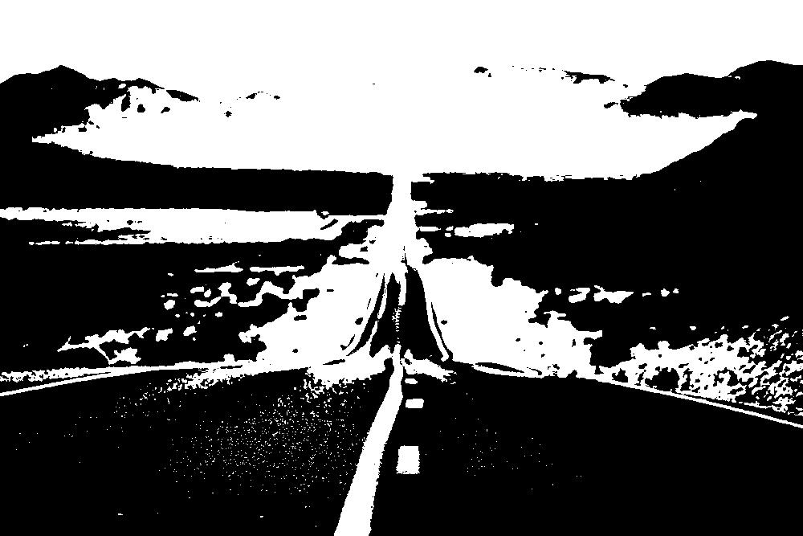

# Projeto de Processamento de Imagens - Redução de Dimensionalidade em Imagens para Redes Neurais

## Descrição
Este projeto faz parte de um exercício de um bootcamp de Machine Learning e tem como objetivo realizar a transformação de uma imagem colorida para:
- **Níveis de cinza** (valores de 0 a 255).
- **Imagem binarizada** (valores 0 e 255, preto e branco).

O foco do projeto é demonstrar a redução de dimensionalidade em imagens, um conceito importante para redes neurais e Machine Learning.

---

## Funcionalidades
1. **Carregar uma imagem colorida** do Google Drive.
2. **Converter a imagem para níveis de cinza** utilizando pesos que representam a percepção do olho humano para as cores RGB.
3. **Transformar a imagem em preto e branco (binarização)** com base em um limiar ajustável.
4. **Exibir e salvar as imagens resultantes** no Colab, no formato PNG.

---

## Exemplos de Saída
| Imagem Original       | Tons de Cinza          | Binarizada           |
|-----------------------|------------------------|----------------------|
|  |  |  |

---

## Tecnologias Utilizadas
- **Python 3**
- **Google Colab**
- **Bibliotecas**:
  - `numpy`: Manipulação de arrays e cálculo matricial.
  - `Pillow`: Processamento de imagens (conversão e salvamento).
  - `matplotlib`: Exibição de imagens no notebook.

---

## Instruções de Uso

### Pré-requisitos
1. Conta no Google Drive para armazenar as imagens.
2. Google Colab para executar o código.

### Passo a Passo
1. Faça upload da imagem colorida no seu Google Drive.
2. No código, ajuste o caminho para o arquivo:
   ```python
   caminho_imagem = '/content/drive/MyDrive/sua_imagem.png'
   ```
3. Execute o notebook para processar a imagem.
4. Visualize as imagens no Colab:
   - Original
   - Tons de cinza
   - Preto e branco (binarizada).
5. As imagens processadas serão salvas no Google Drive:
   - `imagem_cinza.png`
   - `imagem_binarizada.png`

---

## Estrutura do Código
1. **Carregar Imagem**: Lê a imagem do Google Drive.
2. **Converter para Tons de Cinza**: Aplica pesos aos canais RGB.
3. **Binarizar Imagem**: Utiliza um limiar para transformar os pixels em preto ou branco.
4. **Exibir Imagens**: Mostra as etapas do processo no Colab.
5. **Salvar Imagens**: Exporta as imagens processadas no formato PNG.


---

## Autor
Desenvolvido por Wanderson Gustavo.

---

## Licença
Este projeto é livre para uso e modificação. Sinta-se à vontade para contribuir ou adaptá-lo para suas necessidades!
