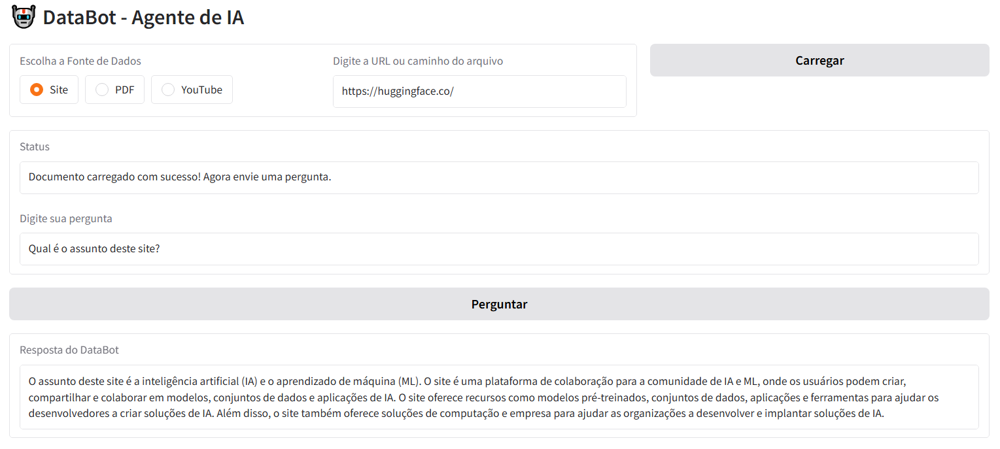

# 🤖 DataBot - Assistente de IA

DataBot é um assistente de IA interativo que permite carregar documentos de diferentes fontes (sites, PDFs e vídeos do YouTube) e fazer perguntas baseadas no conteúdo carregado. Ele utiliza técnicas avançadas de **Processamento de Linguagem Natural (NLP)** para fornecer respostas precisas e contextuais.



## 🚀 Tecnologias Utilizadas

- **[Gradio](https://www.gradio.app/)** - Framework para criar interfaces interativas de IA.
- **[LangChain](https://www.langchain.com/)** - Framework para estruturar fluxos de dados e IA.
  - **WebBaseLoader** - Carregamento de conteúdo de sites.
  - **YoutubeLoader** - Extração de transcrições de vídeos do YouTube.
  - **PyPDFLoader** - Leitura e processamento de arquivos PDF.
- **[FAISS](https://faiss.ai/)** - Ferramenta de busca vetorial para encontrar informações relevantes nos documentos.
- **[Sentence Transformers](https://huggingface.co/sentence-transformers)** - Modelo `all-MiniLM-L6-v2` para transformar texto em vetores numéricos.
- **[Groq API](https://groq.com/)** - Utilização do modelo **Llama 3.3-70b** para geração de respostas.

## 🛠️ Como Executar o Projeto

### 1️⃣ Instalar Dependências

```bash
pip install gradio langchain langchain_community faiss-cpu sentence-transformers
```

### 2️⃣ Configurar a API

Crie um arquivo `.env` ou defina a variável de ambiente para sua chave de API do Groq:

```bash
export GROQ_API_KEY='SUA_CHAVE_API_AQUI'
```

### 3️⃣ Executar o Script

```bash
python seu_arquivo.py
```

## 📌 Funcionalidades

✅ **Carregar documentos de diferentes fontes**: 
- URL de sites
- Arquivos PDF locais
- Transcrição de vídeos do YouTube

✅ **Indexação e Busca Inteligente**:
- Conversão de texto em vetores semânticos
- Pesquisa eficiente usando FAISS

✅ **Respostas Contextualizadas**:
- Integração com IA (Llama 3.3-70b via Groq API)
- Busca e utilização de informações relevantes para responder perguntas

## 📜 Exemplo de Uso

1. Escolha a fonte de dados (**Site, PDF ou YouTube**)
2. Insira a URL ou caminho do arquivo e clique em **Carregar**
3. Após o carregamento, faça perguntas relacionadas ao conteúdo

## 🏗️ Melhorias Futuras

🔹 Suporte para mais formatos de documentos (TXT, DOCX, etc.)  
🔹 Integração com outras APIs de IA (GPT, Claude, Gemini)  
🔹 Melhoria na interface com mais opções de personalização  

## 📄 Licença

Este projeto é de código aberto e está disponível sob a licença MIT.

---


  
